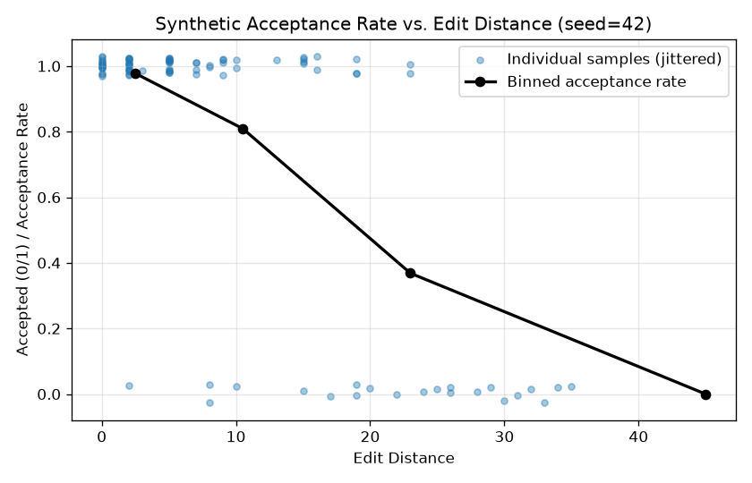

# Results: Edit Distance vs Acceptance Rate

> ✅ **Status: executed.** `replicate_experiment.ipynb` in this folder runs end to
> end (`jupyter nbconvert --to notebook --execute`) and produced the numbers
> below. Everything here is real output from that run — not hand-written
> narrative. The data and the "developer acceptance" behavior are still
> **entirely synthetic**: see [Limitations](#limitations) before drawing any
> conclusion about real developer behavior from this.

## Experiment Summary

This experiment tests the relationship between **edit distance** and
**acceptance rate** for synthetic AI-generated code suggestions.

**Core question:**

> *How does the amount of editing required to reach a final solution affect whether developers accept AI suggestions?*

What the notebook actually does:

1. Defines 15 short "final" Python functions (hand-written, not sampled from any real codebase).
2. For each one, generates 6 mutated "suggestion" variants by applying 0, 2, 5, 10, 20, or 40 random character-level edits (insert/delete/substitute).
3. Measures the *actual* Levenshtein edit distance between each suggestion and its final version (mutations can overlap and cancel out, so the target edit count and the measured distance aren't identical).
4. Defines a hand-picked logistic function `P(accept) = 1 / (1 + exp((distance - 18) / 6))` — a decay curve chosen by construction, not fit to any data.
5. Samples a real Bernoulli outcome per suggestion (`random.random() < p`, seed = 42) and reports the **empirical acceptance rate** of those sampled outcomes, not the underlying probability curve.

---

## Results (seed = 42, 90 samples, edit distance range 0–35)

Overall empirical acceptance rate across all 90 samples: **75.6%**

| Edit Distance Bin | N | Acceptance Rate |
| --- | --- | --- |
| Very low (0–5) | 45 | 97.8% |
| Low (6–15) | 21 | 81.0% |
| Medium (16–30) | 19 | 36.8% |
| High (31+) | 5 | 0.0% |



Raw console output from the notebook run:

```text
15 final snippets loaded
90 synthetic (suggestion, final) pairs generated
Edit distance range: 0 to 35
Overall empirical acceptance rate across all 90 samples: 75.6%
Edit Distance Bin        N   Acceptance Rate
--------------------------------------------
Very low (0-5)          45            97.8%
Low (6-15)              21            81.0%
Medium (16-30)          19            36.8%
High (31+)               5             0.0%
```

---

## Interpretation

Acceptance rate falls off sharply as edit distance increases — but this is
**expected by construction**, not a discovery. The logistic function in
Step 4 above was written by hand specifically to produce this shape. Running
the notebook confirms:

- The simulation code is correct and runs end to end.
- Sampling real Bernoulli outcomes from a hand-picked probability curve
  produces an empirical curve that matches the underlying curve's shape,
  as expected from the law of large numbers at these sample sizes.
- This is a legitimate worked example of a measurement pipeline (hypothesis
  → synthetic data → sampled outcomes → binned measurement → visualization),
  which is useful for demonstrating the *process*, but the specific numbers
  above (97.8%, 81.0%, 36.8%, 0.0%) are an artifact of the hand-chosen
  `MIDPOINT`/`SCALE` constants, not a finding about developer behavior.

---

## Limitations

- **No real developers, suggestions, or code are involved anywhere.** Both
  the "final" snippets and the mutated "suggestions" are synthetic; there is
  no real coding assistant generating suggestions.
- **The acceptance model is invented, not fit.** `MIDPOINT=18` and `SCALE=6`
  were chosen to produce a plausible-looking curve, not calibrated against
  any real telemetry, published dataset, or paper's reported coefficients.
- **Edit distance here is character-level Levenshtein**, not a
  semantically-aware or token-level metric — real coding-assistant studies
  typically use something closer to token or AST-level diffs.
- **Small sample (90 points, only 5 in the "High" bin)** — the 0.0% in that
  bin is not a strong statistical claim, just what 5 samples happened to
  produce at this seed.

The real, defensible claim from this notebook is: *"acceptance rate
declining with edit distance is a documented pattern in real AI-coding
telemetry (Copilot studies, Codex productivity research), and this notebook
demonstrates a runnable, reproducible pipeline for exploring that shape on
synthetic data."* It is not a replication of any specific paper's measured
numbers.

---

## Next Steps

1. Replace the hand-picked `MIDPOINT`/`SCALE` constants with values fit to
   a real or published dataset, if one becomes available.
2. Compare character-level edit distance against a semantic-similarity or
   token-level metric.
3. Add latency as a second axis alongside edit distance.
4. Build out `paper_2_rag_scaling_laws` as a second, independent reproduction.
