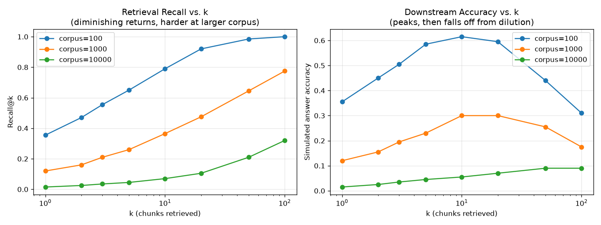

# Results: RAG Scaling Laws — Retrieval Recall & Answer Accuracy vs. k

> ✅ **Status: executed.** `replicate_experiment.ipynb` in this folder runs end
> to end (`jupyter nbconvert --to notebook --execute`) and produced the
> numbers below. The retrieval ranking and recall measurement are real
> computations over synthetic vectors. The "downstream answer accuracy" is a
> **simulation on top of that real measurement**: see
> [Limitations](#limitations) before drawing any conclusion about a real
> embedding model, retriever, or LLM from this.

## Experiment Summary

This experiment tests two related scaling relationships in retrieval-augmented
generation:

**Core questions:**

> *How does retrieval recall scale with k (number of retrieved chunks) and
> corpus size? And does downstream answer accuracy keep improving as k grows,
> or does adding more retrieved context eventually hurt?*

What the notebook actually does:

1. For each of three synthetic corpus sizes (100, 1,000, 10,000 documents),
   generates 200 synthetic queries. Each query has exactly one truly relevant
   document embedding (cosine similarity to the query centered around
   `RELEVANCE_ALPHA = 0.35` by construction) and `corpus_size - 1` unrelated
   random-vector "distractor" documents.
2. Ranks the full corpus by cosine similarity to each query and records the
   real rank of the relevant document — this is the actual retrieval
   computation, not a hand-typed curve.
3. Computes **Recall@k** for k in `[1, 2, 3, 5, 10, 20, 50, 100]` as the
   fraction of the 200 queries where the relevant document's rank is `<= k`.
4. Defines a hand-picked "context dilution" function
   `dilution_factor(k) = 1 / (1 + 0.03 * (k - 1))`, modeling the idea that
   each extra retrieved chunk makes it harder for a downstream LLM to use the
   one relevant chunk correctly.
5. For each query, samples a real Bernoulli outcome with probability
   `dilution_factor(k)` if the relevant doc was retrieved (0 otherwise, seed
   = 42), and reports the **empirical mean** of those outcomes as
   accuracy@k — not the dilution curve itself.

---

## Results (seed = 42, embedding dim = 32, 200 queries per corpus size)

### Recall@k

| k | corpus=100 | corpus=1,000 | corpus=10,000 |
| --- | --- | --- | --- |
| 1 | 35.5% | 12.0% | 1.5% |
| 2 | 47.0% | 16.0% | 2.5% |
| 3 | 55.5% | 21.0% | 3.5% |
| 5 | 65.0% | 26.0% | 4.5% |
| 10 | 79.0% | 36.5% | 7.0% |
| 20 | 92.0% | 47.5% | 10.5% |
| 50 | 98.5% | 64.5% | 21.0% |
| 100 | 100.0% | 77.5% | 32.0% |

### Simulated answer accuracy@k

| k | corpus=100 | corpus=1,000 | corpus=10,000 |
| --- | --- | --- | --- |
| 1 | 35.5% | 12.0% | 1.5% |
| 2 | 45.0% | 15.5% | 2.5% |
| 3 | 50.5% | 19.5% | 3.5% |
| 5 | 58.5% | 23.0% | 4.5% |
| 10 | **61.5%** | **30.0%** | 5.5% |
| 20 | 59.5% | 30.0% | 7.0% |
| 50 | 44.0% | 25.5% | **9.0%** |
| 100 | 31.0% | 17.5% | 9.0% |

Best k found by the notebook: **k=10** for corpus=100 (61.5%), **k=10** for
corpus=1,000 (30.0%), **k=50** for corpus=10,000 (9.0%, tied with k=100).



Raw console output from the notebook run (Steps 2–3):

```text
Recall@k
     k      corpus=100     corpus=1000    corpus=10000
     1           35.5%           12.0%            1.5%
     2           47.0%           16.0%            2.5%
     3           55.5%           21.0%            3.5%
     5           65.0%           26.0%            4.5%
    10           79.0%           36.5%            7.0%
    20           92.0%           47.5%           10.5%
    50           98.5%           64.5%           21.0%
   100          100.0%           77.5%           32.0%

Dilution factor by k:
  k=  1: 1.000
  k=  2: 0.971
  k=  3: 0.943
  k=  5: 0.893
  k= 10: 0.787
  k= 20: 0.637
  k= 50: 0.405
  k=100: 0.252

Simulated answer accuracy@k
     k      corpus=100     corpus=1000    corpus=10000
     1           35.5%           12.0%            1.5%
     2           45.0%           15.5%            2.5%
     3           50.5%           19.5%            3.5%
     5           58.5%           23.0%            4.5%
    10           61.5%           30.0%            5.5%
    20           59.5%           30.0%            7.0%
    50           44.0%           25.5%            9.0%
   100           31.0%           17.5%            9.0%
Best k for corpus_size=100: k=10 (accuracy=61.5%)
Best k for corpus_size=1000: k=10 (accuracy=30.0%)
Best k for corpus_size=10000: k=50 (accuracy=9.0%)
```

---

## Interpretation

Two distinct patterns show up, and they're measured differently:

- **Recall@k (real measurement):** rises monotonically with k, with clearly
  diminishing returns — going from k=1 to k=10 buys far more recall than
  going from k=50 to k=100 — and a larger corpus needs a much larger k to
  reach the same recall (corpus=10,000 only reaches 32.0% recall at k=100,
  where corpus=100 already hit 100.0%). This part is a genuine consequence
  of ranking synthetic vectors; nothing about it was hand-picked except the
  overall difficulty (`RELEVANCE_ALPHA`).
- **Accuracy@k (simulated on top of the measurement):** rises with k while
  recall is still the binding constraint, peaks around k=10–50 depending on
  corpus size, then declines — because the hand-picked `dilution_factor(k)`
  eventually dominates. This inverted-U shape was built into the dilution
  function by construction, not discovered. It reproduces the *qualitative*
  pattern reported in real RAG / long-context research (more retrieved
  context helps, then hurts) but the specific peak locations (k=10, k=10,
  k=50) are artifacts of `DILUTION_RATE = 0.03`, not a finding about any real
  retriever or LLM.

The corpus=10,000 curve is flatter and still recall-bound even at k=100 —
at that difficulty and corpus size, retrieval quality remains the bottleneck
throughout the range tested, so the accuracy peak is barely visible in
this window.

---

## Limitations

- **No real documents, queries, embedding model, or LLM are involved
  anywhere.** All embeddings are random unit vectors in a 32-dimensional
  space; "relevance" is simulated by construction (`RELEVANCE_ALPHA=0.35`).
- **The dilution model is invented, not fit.** `DILUTION_RATE=0.03` was
  chosen to produce a plausible-looking peak-then-decline curve within the
  k range tested, not calibrated against any real RAG system's telemetry,
  published dataset, or paper's reported coefficients.
- **Each query has exactly one relevant document.** Real corpora often have
  multiple relevant or partially relevant documents per query, which changes
  recall dynamics substantially.
- **Accuracy is a single Bernoulli sample per query, not a real generation.**
  There's no real LLM reading the retrieved context and producing an answer;
  "correct" is just a coin flip weighted by the hand-picked dilution factor.
- **Corpus size only goes up to 10,000** — real production corpora are often
  orders of magnitude larger, where recall dynamics could look different.

The real, defensible claim from this notebook is: *"retrieval recall scaling
with diminishing returns in k, and downstream accuracy eventually declining
from added irrelevant context, are documented patterns in RAG and
long-context research, and this notebook demonstrates a runnable,
reproducible pipeline for exploring those shapes on synthetic data."* It is
not a replication of any specific paper's measured numbers or optimal-k
recommendation.

---

## Next Steps

1. Replace `RELEVANCE_ALPHA` and `DILUTION_RATE` with values fit to a real
   or published RAG evaluation dataset, if one becomes available.
2. Swap the random-vector corpus for real text embeddings (e.g., a small
   sentence-transformer model) over a real document set.
3. Model multiple relevant documents per query instead of exactly one.
4. Replace the Bernoulli-sampled "accuracy" with an actual LLM call over the
   retrieved context, to measure real dilution effects instead of simulating
   them.
