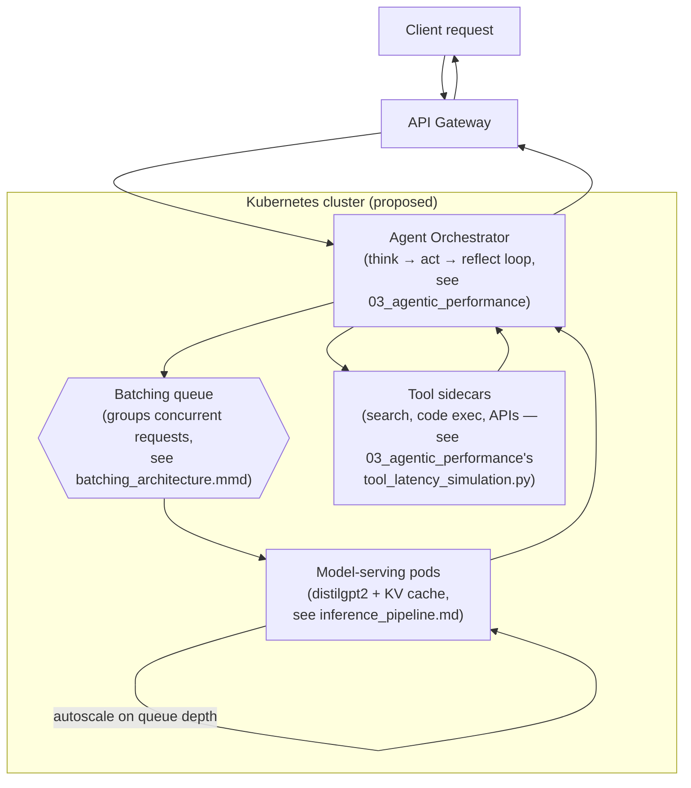

# Container Orchestration — Proposed Deployment Architecture

> ⚠️ **Status: conceptual design sketch, not implemented.** There is no
> `Dockerfile`, Compose file, or Kubernetes manifest anywhere in this repo.
> This diagram shows how the components *measured elsewhere in this lab*
> (inference latency, batching tradeoffs, agent-loop overhead) would
> plausibly compose into a containerized production deployment — it is a
> proposal for future work, not a description of running infrastructure.

## What This Diagram Is Modeling

Each box maps back to something actually measured or benchmarked elsewhere
in this repo, not an arbitrary architecture:

- **Model-serving pods** — the per-request cost this repo attempted to
  measure in [`01_inference_profiling`](../01_inference_profiling/). The
  first-token-vs-cached-token gap is a real, well-documented mechanism in
  production LLM serving, but this repo's own benchmark of it doesn't
  currently reproduce a meaningful gap — see
  [`inference_pipeline.md`](inference_pipeline.md) and
  [`RESULTS_kv_cache_analysis.md`](../01_inference_profiling/RESULTS_kv_cache_analysis.md#-limitations)
  for why. Treat "model-serving pods benefit from a warm KV cache" as
  general LLM-serving knowledge here, not something this repo measured.
- **Batching queue** — grouping concurrent requests the way
  `benchmark_batching_effects.py` does, where this repo's CPU-only hardware
  showed tokens/sec throughput climbing from ~32 (batch 1) to ~113
  (batch 8), even though per-batch latency also rises — see
  [`batching_architecture.mmd`](batching_architecture.mmd). A GPU-backed
  deployment would likely show a larger and cleaner effect; this repo never
  measured one, and even the CPU numbers vary noticeably run to run.
- **Agent Orchestrator / Tool sidecars** — the think→act→reflect loop and
  tool-call latency modeled in
  [`03_agentic_performance`](../03_agentic_performance/README.md), where
  tool latency (not model latency) is usually the real bottleneck.

## Limitations

- **The KV-cache benefit on the "Model-serving pods" box is asserted, not
  measured by this repo.** `benchmark_kv_cache_analysis.py`'s methodology
  doesn't actually persist a cache across its measured calls, so its
  headline speedup number doesn't reproduce — see the results file's
  Limitations section. The mechanism is real in production LLM serving;
  this repo just doesn't have a working benchmark of it yet.
- **Nothing here is deployed or even containerized.** No Dockerfile,
  Kubernetes manifest, Helm chart, or Terraform config exists in this repo —
  the boxes above are a proposal, grounded in this repo's own benchmark
  numbers, not a description of an existing system.
- **Autoscaling behavior is asserted, not measured.** This repo never ran
  a multi-pod or multi-node experiment; "autoscale on queue depth" describes
  a plausible policy, not something benchmarked here.
- **No error handling, retries, or failure modes are shown** — those are
  covered conceptually (and simulated, not measured) in
  `03_agentic_performance/error_recovery_costs.py`, but aren't drawn into
  this diagram.

## Next Steps

1. Write an actual `Dockerfile` for the model-serving component and measure
   real container-startup and cold-start latency.
2. Prototype the batching queue against a real request generator instead of
   the benchmark script's fixed batch sizes.
3. Replace the "proposed" Kubernetes box with a real manifest and measure
   actual autoscaling behavior under load.
