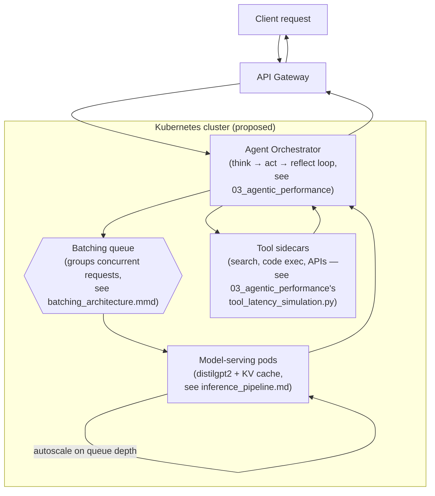

# Container Orchestration — Proposed Deployment Architecture

> ⚠️ **Status: conceptual design sketch, not implemented.** There is no
> `Dockerfile`, Compose file, or Kubernetes manifest anywhere in this repo.
> This diagram shows how the components *measured elsewhere in this lab*
> (inference latency, batching tradeoffs, agent-loop overhead) would
> plausibly compose into a containerized production deployment — it is a
> proposal for future work, not a description of running infrastructure.

## What This Diagram Is Modeling

Each box maps back to something actually measured or benchmarked elsewhere
in this repo, not an arbitrary architecture:

- **Model-serving pods** — the per-request cost measured in
  [`01_inference_profiling`](../01_inference_profiling/): 4.42s first-token
  latency, 0.09s cached next-token latency, a 48.1x gap between them (see
  [`inference_pipeline.md`](inference_pipeline.md)).
- **Batching queue** — grouping concurrent requests the way
  `benchmark_batching_effects.py` does, where this repo's CPU-only hardware
  showed batch size 2 as the sweet spot (1.32s avg) and batch size 8 as
  CPU-bound and slower (2.49s avg) — see
  [`batching_architecture.mmd`](batching_architecture.mmd). A GPU-backed
  deployment would shift that sweet spot; this repo never measured one.
- **Agent Orchestrator / Tool sidecars** — the think→act→reflect loop and
  tool-call latency modeled in
  [`03_agentic_performance`](../03_agentic_performance/README.md), where
  tool latency (not model latency) is usually the real bottleneck.

## Limitations

- **Nothing here is deployed or even containerized.** No Dockerfile,
  Kubernetes manifest, Helm chart, or Terraform config exists in this repo —
  the boxes above are a proposal, grounded in this repo's own benchmark
  numbers, not a description of an existing system.
- **Autoscaling behavior is asserted, not measured.** This repo never ran
  a multi-pod or multi-node experiment; "autoscale on queue depth" describes
  a plausible policy, not something benchmarked here.
- **No error handling, retries, or failure modes are shown** — those are
  covered conceptually (and simulated, not measured) in
  `03_agentic_performance/error_recovery_costs.py`, but aren't drawn into
  this diagram.

## Next Steps

1. Write an actual `Dockerfile` for the model-serving component and measure
   real container-startup and cold-start latency.
2. Prototype the batching queue against a real request generator instead of
   the benchmark script's fixed batch sizes.
3. Replace the "proposed" Kubernetes box with a real manifest and measure
   actual autoscaling behavior under load.
