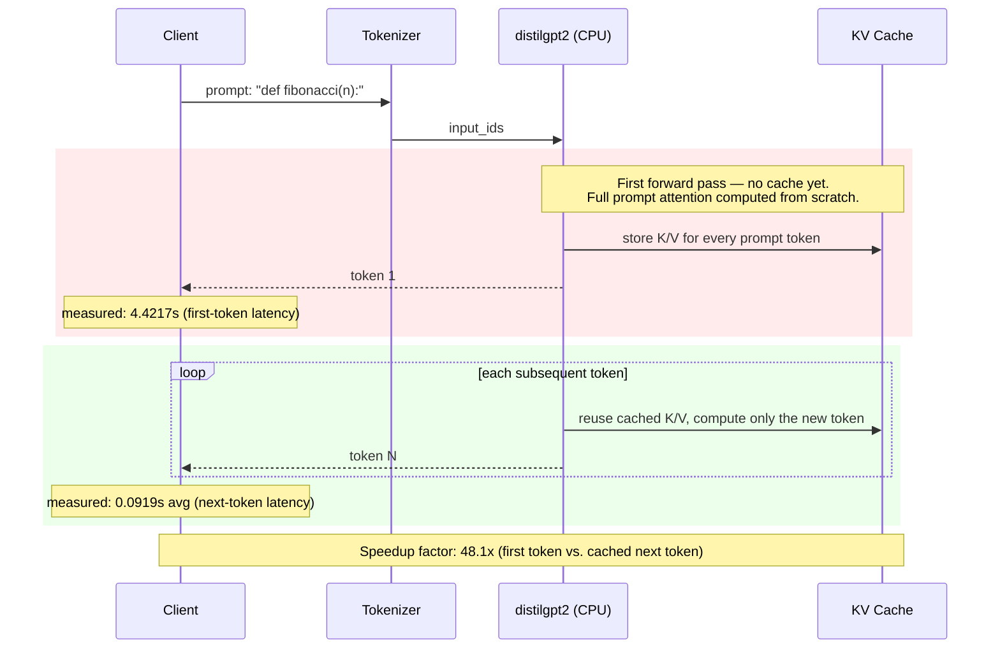

# Inference Pipeline — Sequence Diagram

This diagram walks through a single inference request against the
`distilgpt2` model as actually run in
[`01_inference_profiling`](../01_inference_profiling/), stage by stage, with
the real measured latencies from
[`RESULTS_kv_cache_analysis.md`](../01_inference_profiling/RESULTS_kv_cache_analysis.md)
attached to each stage.

## What's Real vs. What's a Simplification

- **The latency numbers are real**, taken directly from
  `01_inference_profiling/benchmark_kv_cache_analysis.py`'s output on a
  MacBook Air (i5-8210Y, CPU-only, no GPU) — see the linked RESULTS file for
  the raw console output and hardware snapshot.
- **The diagram itself is a simplification.** It shows the conceptual
  request path (tokenize → first pass → cached decode loop) that the
  benchmark script measures; it does not show batching, request queuing, or
  any serving infrastructure — those are separate concerns covered in
  [`batching_architecture.mmd`](batching_architecture.mmd) and
  [`container_orchestration.md`](container_orchestration.md).
- No production serving stack (vLLM, TGI, etc.) is depicted or implied —
  this is the bare HuggingFace `generate()` loop that the benchmark scripts
  actually call.

## Why This Matters

The 48x gap between first-token and next-token latency is why chat and
coding-assistant UX is dominated by **time-to-first-token**, not steady-state
throughput — once the KV cache is warm, additional tokens are comparatively
cheap. This is the same insight
[`03_agentic_performance`](../03_agentic_performance/README.md) builds on:
every new agent step (think → act → reflect) pays a fresh first-token cost,
which is why agent loops feel slower than a single chat turn even when the
model is identical.
