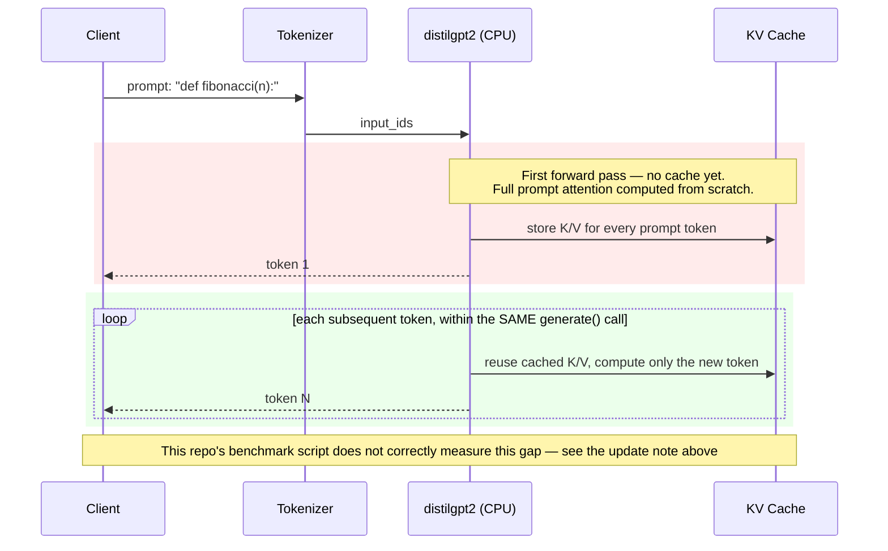

# Inference Pipeline — Sequence Diagram

This diagram walks through a single inference request against the
`distilgpt2` model as actually run in
[`01_inference_profiling`](../01_inference_profiling/), stage by stage.

> ⚠️ **Update:** this diagram originally annotated each stage with a
> measured 4.42s first-token / 0.09s cached next-token / 48.1x speedup.
> Re-running the underlying benchmark (`benchmark_kv_cache_analysis.py`)
> multiple times shows that speedup doesn't reproduce — measured factors
> ranged 0.6x–1.2x, essentially no consistent cache benefit. It turned out
> to be a real methodology gap in the script (each "next token" is measured
> as an independent `generate()` call, so no cache is actually persisted
> between measurements), not just noise. Full details in
> [`RESULTS_kv_cache_analysis.md`](../01_inference_profiling/RESULTS_kv_cache_analysis.md#-limitations).
> The diagram below still shows the *conceptually correct* mechanism —
> that part of the underlying LLM systems knowledge is real and
> well-documented — but this repo's own benchmark does not currently
> demonstrate it, so the timing annotations have been removed rather than
> left showing a number that doesn't reproduce.

## What's Real vs. What's a Simplification

- **The mechanism shown is real and well-documented in LLM systems
  literature**: a correctly-implemented cache genuinely avoids recomputing
  attention over already-seen tokens.
- **This repo's own measurement of it is not currently trustworthy** — see
  the update note above and
  [`RESULTS_kv_cache_analysis.md`](../01_inference_profiling/RESULTS_kv_cache_analysis.md)
  for why, and what fixing the benchmark would require.
- **The diagram itself is a simplification** regardless of the measurement
  issue. It shows the conceptual request path (tokenize → first pass →
  cached decode loop); it does not show batching, request queuing, or any
  serving infrastructure — those are separate concerns covered in
  [`batching_architecture.mmd`](batching_architecture.mmd) and
  [`container_orchestration.md`](container_orchestration.md).
- No production serving stack (vLLM, TGI, etc.) is depicted or implied —
  this is the bare HuggingFace `generate()` loop that the benchmark scripts
  actually call (or, in the cache-reuse case, currently *should* call
  continuously but don't).

## Why This Matters

The gap between first-token and next-token latency is why chat and
coding-assistant UX is dominated by **time-to-first-token**, not
steady-state throughput, in real production LLM serving — once the KV
cache is warm, additional tokens are comparatively cheap. This is the same
insight [`03_agentic_performance`](../03_agentic_performance/README.md)
builds on: every new agent step (think → act → reflect) pays a fresh
first-token cost, which is why agent loops feel slower than a single chat
turn even when the model is identical. That broader point stands on its
own in the field — this repo just doesn't currently have a benchmark that
demonstrates it correctly.
